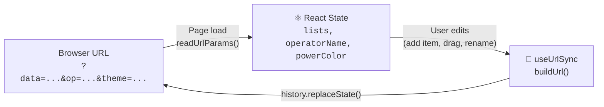
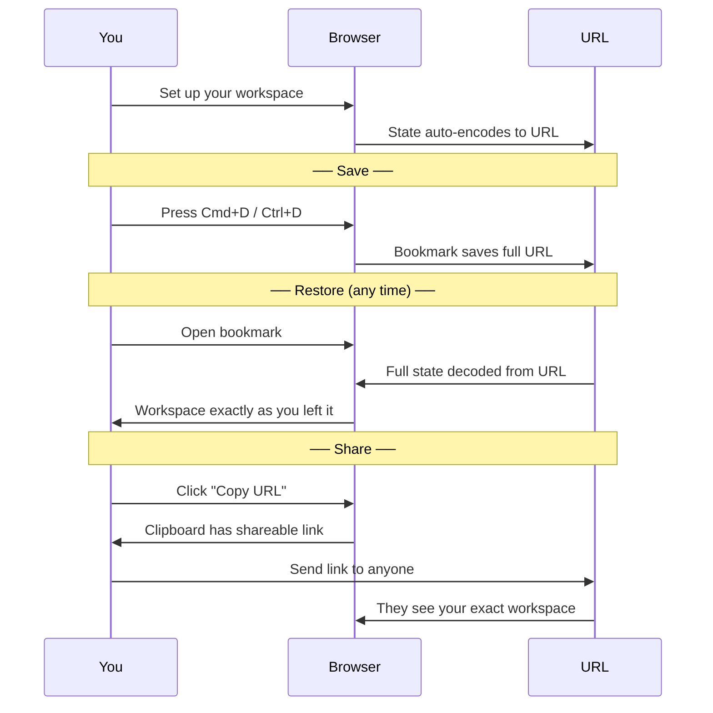

# HitLIST

**DEPLOYED AT : [https://hit-list-nine.vercel.app/](https://hit-list-nine.vercel.app/)**  
[](https://opensource.org/licenses/MIT)

A minimalist, drag-and-drop task manager with zero backend. Your data lives in the URL.

<!-- TODO: Add screenshot or GIF here -->
<!--  -->

## How It Works

No backend, no database, no accounts. HitLIST encodes your entire workspace — lists, positions, theme — into the URL itself.



Every change you make instantly updates the URL. Reload the page — everything is exactly where you left it.

## Save & Share with Bookmarks

The URL **is** your save file. That means:



## Features

*   **Infinite Canvas** — Create, drag, and drop task lists anywhere.
*   **Command Palette** — Press `Cmd+K` to execute batch operations instantly.
*   **Zero Backend** — Share your workspace simply by copying the URL.
*   **Operator Mode** — Toggle themes, manage history, and customize the interface.

## Tech Stack

| Layer | Technology |
|---|---|
| UI Framework | React 19 |
| Bundler | Rsbuild (Rspack) |
| Drag & Drop | react-draggable |
| Language | Vanilla JavaScript |
| Styling | Plain CSS with custom properties |

## Quick Start

```bash
npm install
npm run dev        # Start dev server at http://localhost:3000
npm run build      # Build for production
```

## Architecture

For deep dives into the component tree, URL state lifecycle, and data flow, see the [`/architecture`](./architecture/README.md) folder.

*   [Component Tree](./architecture/component-tree.md)
*   [State Ownership](./architecture/state-ownership.md)
*   [URL Lifecycle](./architecture/url-state-lifecycle.md)
