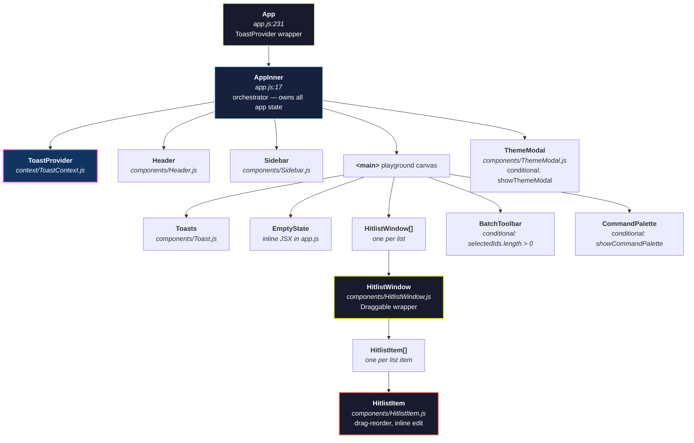

# Component Tree & Data Flow

## Hierarchy



## Props Flow

Data flows top-down from `AppInner` to all children. There is no two-way binding — children receive callbacks and call them to request state changes.

### AppInner → Header

| Prop | Type | Description |
|---|---|---|
| `activeNav` | `'canvas' \| 'commands'` | Highlights current nav item |
| `onNavClick` | `(key) => void` | Switches nav, toggles command palette |
| `onThemeClick` | `() => void` | Opens theme modal |
| `onSettingsClick` | `() => void` | Shows WIP toast |

### AppInner → Sidebar

| Prop | Type | Description |
|---|---|---|
| `activeNav` | `string` | Current nav highlight |
| `operatorName` | `string` | Controlled name display |
| `onOperatorNameChange` | `(name) => void` | Updates operator name → URL |
| `lists` | `Array` | For recent lists section |
| `onClear` | `() => void` | Requests clear-all with confirmation toast |
| `onOpenList` | `(id) => void` | Focuses a list from history |
| `onCopy` | `() => void` | Copies full URL to clipboard |
| `onBookmark` | `() => void` | Shows bookmark shortcut toast |
| `onCreate` | `() => void` | Creates new list |
| `onNavClick` | `(key) => void` | Nav switching |
| `onThemeClick` | `() => void` | Opens theme modal |
| `onLogoutClick` | `() => void` | Shows WIP toast |

### AppInner → HitlistWindow (per list)

| Prop | Source | Description |
|---|---|---|
| `list` | `useLists.lists[i]` | The list data object |
| `nodeRef` | `useLists.nodeRefs` | Ref for Draggable |
| `isDragging` | derived from `draggingIds` | CSS class toggle |
| `isFocused` | derived from `focusedId` | CSS class + z-index |
| `isSelected` | derived from `selectedIds` | CSS class + border |
| `paletteOpenId` | `useLists` | Which window has color picker open |
| `handleDragStop` | `useLists` | Saves position after drag |
| `setListColor` | `useLists` | Changes window accent color |
| `updateListTitle` | `useLists` | Renames the list |
| `closeList` | `useLists` | Removes list, may show home |
| `toggleSelect` | `useLists` | Batch selection checkbox |
| `addItem` | `useLists` | Adds item to this list |
| `removeItem` | `useLists` | Removes item by index |
| `editingItem/editingValue` | `useLists` | Which item is being edited |
| `draggedItem/dragOverState` | `useLists` | Item drag-reorder visuals |
| drag callbacks | `useLists` | onItemDragStart/Over/Drop/End |

### HitlistWindow → HitlistItem (per item)

| Prop | Description |
|---|---|
| `listId` + `index` | Identifies the item's position |
| `item` | The item data `{ id, text }` |
| `editingItem` | Whether this specific item is being edited |
| `editingValue` | Current edit buffer |
| `draggedItem` | Whether this item is being dragged |
| `dragOverState` | Visual drop indicator |
| `startEditing` | Double-click to edit |
| `saveEditing` | Enter or blur to save |
| `cancelEditing` | Escape to cancel |
| `removeItem` | Delete button |

### AppInner → BatchToolbar

| Prop | Description |
|---|---|
| `selectedCount` | Number of selected lists |
| `onDelete` | Batch delete selected |
| `onColor` | Batch color change selected |
| `onClose` | Deselect all |

### AppInner → ThemeModal

| Prop | Description |
|---|---|
| `show` | Visibility toggle |
| `onClose` | Closes modal |
| `onCommit` | Applies color: sets state + DOM |
| `initialColor` | Pre-selects current power color |

### AppInner → CommandPalette

| Prop | Description |
|---|---|
| `show` | Visibility toggle |
| `onClose` | Closes + resets nav |
| `onAction` | Dispatches `batchDelete` or `changeAccent` |

## Data Flow Patterns

```
User action
    │
    ▼
Component callback (e.g., addItem)
    │
    ▼
AppInner / useLists handler
    │
    ▼
setState (React schedules re-render)
    │
    ├──────────────────────────┐
    ▼                          ▼
React re-renders         useUrlSync detects
components with          dep change →
new state values         buildUrl() → replaceState
```

Key insight: **every state change flows through the same path**. There is no ad-hoc URL manipulation outside of `useUrlSync`. This ensures the URL is always a complete, consistent snapshot of `lists` + `operatorName` + `powerColor`.
