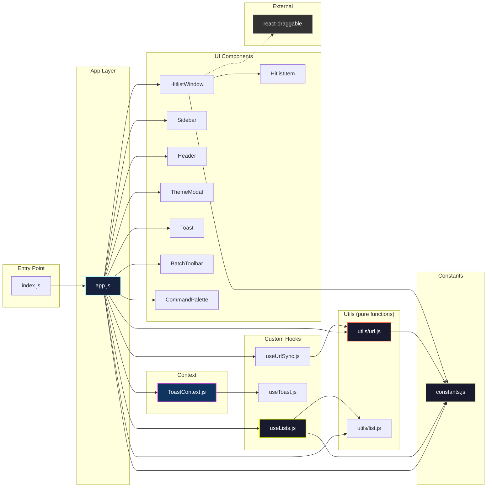

# Module Dependencies

## Full Import Graph



## Layer Descriptions

### Utils — pure functions, no React

These are the easiest to test and reason about. They have zero knowledge of React state, components, or hooks.

| File | Exports | Purpose |
|---|---|---|
| `utils/url.js` | `readUrlParams()`, `buildUrl()`, `buildShareUrl()`, `DEFAULT_OPERATOR`, `DEFAULT_POWER_COLOR` | Read/write URL search params. No side effects — `buildUrl` returns a string, doesn't call `replaceState`. |
| `utils/list.js` | `createNewList()`, `normalizeItems()` | Factory for new list objects. Migration helper for legacy string-format items. |

### Constants — shared config

| File | Exports | Purpose |
|---|---|---|
| `constants.js` | `MAX_URL_LENGTH` (50000), `PALETTE` (5 colors) | Magic numbers and shared arrays. Single source of truth. |

### Hooks — stateful logic, no UI

| File | Exports | Owns state? | Depends on |
|---|---|---|---|
| `useToast` | `useToast()` hook | Yes: `toasts[]` | — |
| `useLists` | `useLists()` hook | Yes: 10+ states (see [state-ownership](./state-ownership.md)) | `utils/list`, `constants`, receives `addToast` + `setShowHome` as params |
| `useUrlSync` | `useUrlSync()` hook | No — side effect only | `utils/url` |

### Context — cross-component access

| File | Exports | Wraps | Purpose |
|---|---|---|---|
| `ToastContext` | `ToastProvider`, `useToastContext()` | `useToast` hook | Any component can `addToast()` without prop drilling |

### Components — UI only

All components are presentational. They receive data and callbacks as props. None manage global state internally.

| Component | Has internal state? | Internal state type |
|---|---|---|
| Header | No | — |
| Sidebar | Minimal | `isEditingName` (toggle), `nameInputRef` |
| HitlistWindow | No | — |
| HitlistItem | No | — |
| Toast | No | — |
| BatchToolbar | No | — |
| CommandPalette | Yes | `searchTerm` (local filter) |
| ThemeModal | Yes | `selectedColor` (local preview) |

### Dependency Rules

```
constants.js      ← used by everything, depends on nothing
utils/*           ← depends on constants only
hooks/*           ← depends on utils + constants
context/*         ← depends on hooks
components/*      ← depends on constants, receives data via props
app.js            ← depends on everything (orchestrator)
```

There are no circular dependencies. The dependency graph is a DAG flowing upward from constants/utils to the app layer.
