# State Ownership

## Which Module Owns Which State

```mermaid
graph TD
    subgraph "AppInner (app.js) — owns these states"
        OP["operatorName<br/><i>useState</i><br/>string"]
        PC["powerColor<br/><i>useState</i><br/>string hex"]
        SH["showHome<br/><i>useState</i><br/>boolean"]
        PN["playgroundName<br/><i>useState + localStorage</i><br/>string"]
        SCP["showCommandPalette<br/><i>useState</i><br/>boolean"]
        STM["showThemeModal<br/><i>useState</i><br/>boolean"]
        AN["activeNav<br/><i>useState</i><br/>'canvas' | 'commands'"]
    end

    subgraph "useLists — owns these states"
        LISTS["lists<br/><i>useState</i><br/>Array of list objects"]
        DI["draggingIds<br/><i>useState</i><br/>number[]"]
        FI["focusedId<br/><i>useState</i><br/>number | null"]
        PI["paletteOpenId<br/><i>useState</i><br/>number | null"]
        SI["selectedIds<br/><i>useState</i><br/>number[]"]
        EI["editingItem<br/><i>useState</i><br/>{ listId, index } | null"]
        EV["editingValue<br/><i>useState</i><br/>string"]
        DRI["draggedItem<br/><i>useState</i><br/>{ listId, index } | null"]
        DOS["dragOverState<br/><i>useState</i><br/>{ listId, index, position } | null"]
        NR["nodeRefs<br/><i>useRef</i><br/>{ [id]: Ref }"]
    end

    subgraph "ToastContext — owns this state"
        TOASTS["toasts<br/><i>useState</i><br/>Array of toast objects"]
    end

    subgraph "useUrlSync — side effect only (no state)"
        SYNC["URL write<br/><i>useEffect + history.replaceState</i>"]
    end

    OP --> SYNC
    PC --> SYNC
    LISTS --> SYNC

    LISTS --> |"rendered by"| HW["HitlistWindow[]"]
    DI --> HW
    FI --> HW
    PI --> HW
    SI --> HW
    SI --> BT["BatchToolbar"]
    EI --> |"passed through HW"| HI["HitlistItem"]
    EV --> HI
    DRI --> HI
    DOS --> HI

    style LISTS fill:#1a1a2e,stroke:#daf900,stroke-width:3px,color:#fff
    style OP fill:#16213e,stroke:#c1fffe,stroke-width:2px,color:#fff
    style PC fill:#16213e,stroke:#ff51fa,stroke-width:2px,color:#fff
    style SYNC fill:#1a1a2e,stroke:#ff7351,stroke-width:2px,color:#fff
    style TOASTS fill:#0f3460,stroke:#f6ffc0,stroke-width:2px,color:#fff
```



## State by Owner

### AppInner (app.js)

| State | Type | Purpose | Source of truth |
|---|---|---|---|
| `operatorName` | `string` | Displayed in sidebar, encoded in URL | URL `?op=` on load, then local state |
| `powerColor` | `string` | Applied to `--power-color` CSS var, encoded in URL | URL `?theme=` on load, then local state |
| `showHome` | `boolean` | Toggles empty state vs list canvas | Inferred from URL `?data=` on load |
| `playgroundName` | `string` | Default name for new lists | `localStorage` only |
| `showCommandPalette` | `boolean` | Modal visibility | Local UI state |
| `showThemeModal` | `boolean` | Modal visibility | Local UI state |
| `activeNav` | `'canvas' \| 'commands'` | Header/sidebar navigation | Local UI state |

### useLists (hooks/useLists.js)

| State | Type | Purpose | Affects |
|---|---|---|---|
| `lists` | `Array<List>` | All list data (core domain model) | URL `?data=`, HitlistWindow rendering |
| `draggingIds` | `number[]` | IDs of windows being dragged | CSS `.dragging` class |
| `focusedId` | `number \| null` | Which window has focus (temporary) | CSS `.focused` class + z-index |
| `paletteOpenId` | `number \| null` | Which window has color picker open | Color palette visibility |
| `selectedIds` | `number[]` | Lists selected for batch ops | Checkbox state, BatchToolbar visibility |
| `editingItem` | `{ listId, index } \| null` | Which item is being inline-edited | HitlistItem input mode |
| `editingValue` | `string` | Edit buffer for inline editing | HitlistItem input value |
| `draggedItem` | `{ listId, index } \| null` | Which item is being dragged | Drag visual feedback |
| `dragOverState` | `{ listId, index, position } \| null` | Where item will drop | Drag indicator visuals |
| `nodeRefs` | `RefObject` | Refs for `react-draggable` components | Draggable behavior |

### ToastContext (context/ToastContext.js)

| State | Type | Purpose | Affects |
|---|---|---|---|
| `toasts` | `Array<Toast>` | Active toast notifications | Toasts component rendering |

### useUrlSync (hooks/useUrlSync.js)

No state owned — this is a pure side-effect hook. It reads the three URL-relevant state values (`lists`, `operatorName`, `powerColor`) and writes them to the browser URL when they change.

## Complex Relationships

### 1. useLists ↔ AppInner (cross-hook dependency)

`useLists` receives two callbacks as parameters:

```javascript
const listsApi = useLists(normalizedLists, setShowHome, addToast);
```

**Why this is necessary:**

- `useLists` owns list mutations (add, remove, close, etc.)
- But `setShowHome` (toggle empty state) is owned by AppInner
- And `addToast` (user feedback) is owned by ToastContext

**The dependency pattern:**

| Function in useLists | Calls back into | Purpose |
|---|---|---|
| `closeList()` | `setShowHome(true)` | If no lists remain, show home screen |
| `requestClearAll()` | `addToast(...)` | Creates confirmation toast with "Clear" action |
| `batchDelete()` | `addToast(...)` | Shows success count |
| `batchColor()` | `addToast(...)` | Shows info count |

**Potential pitfall:** `addToast` is captured in the hook's closure. If `addToast` changed identity, the hook would use a stale reference. This doesn't happen because `useToast` always returns the same function objects (stable references), and the hook only runs once with the initial values.

### 2. useUrlSync — three-way synchronization

```
┌──────────────┐
│   lists      │
└──────┬───────┘
       │
       ├─────────────────────────────┐
       ▼                             ▼
┌──────────────┐              ┌──────────────┐
│ operatorName │              │  powerColor  │
└──────┬───────┘              └──────┬───────┘
       │                             │
       └──────────────┬──────────────┘
                      ▼
              ┌──────────────┐
              │  useUrlSync  │
              └──────┬───────┘
                     │
                     ▼
              ┌──────────────┐
              │ Browser URL  │
              └──────────────┘
```

**Key insight:** `useUrlSync` doesn't care which of the three changed. Any change to `lists`, `operatorName`, or `powerColor` triggers a full URL rebuild with all three values.

### 3. Theme — dual-path application

The `powerColor` state is used in two ways:

```javascript
// Path 1: URL sync
const [powerColor, setPowerColor] = useState(urlParams.powerColor);
useUrlSync({ lists, operatorName, powerColor });  // writes to ?theme=

// Path 2: DOM manipulation
document.documentElement.style.setProperty('--power-color', powerColor);
```

**Why not use CSS state?** React can't directly control CSS custom properties via state — it needs to write to the DOM. We do this imperatively on every change.

**Where this happens:**
- On page load (`app.js:39-43`): apply URL theme before first render
- On `handleCommandAction('changeAccent')` (`app.js:91-93`): set state + DOM
- On `handleThemeCommit` (`app.js:108-110`): set state + DOM

### 4. Drag state — local to useLists

All drag-and-drop state is contained within `useLists`:

| State | Purpose | Consumer |
|---|---|---|
| `draggingIds` | Which windows are being dragged | HitlistWindow CSS |
| `focusedId` | Which window has focus | HitlistWindow CSS |
| `draggedItem` | Which item is being dragged | HitlistItem visual |
| `dragOverState` | Where to drop the item | HitlistItem visual |

None of these affect the URL. They are purely transient UI state.

### 5. Refs vs State

`useLists` uses a ref for `nodeRefs` (Draggable refs) because:

- Refs don't trigger re-renders when updated
- We need to store refs dynamically per list ID
- We don't need to "watch" ref changes — they're only used for the `Draggable` component

Contrast with `focusedId` which is state, not a ref — because we need to re-render the window to apply the `.focused` CSS class.

## State Mutation Pattern

All state mutations in `useLists` follow the same pattern:

```javascript
const mutateList = (id) => {
  setLists(prev => prev.map(list =>
    list.id === id ? { ...list, ...changes } : list
  ));
};
```

**Why this works:**

- `setLists` receives a **function** (`prev => ...`), not a value
- This ensures we're always updating from the latest state (no stale closure issues)
- The spread operator creates a new object/list (immutability)
- React detects the new reference and triggers re-render

Example: adding an item

```javascript
const addItem = (id, itemText) => {
  const itemObj = { id: Date.now() + Math.random(), text: itemText };
  setLists(lists.map(list =>
    list.id === id
      ? { ...list, items: [...list.items, itemObj] }  // new array + new list object
      : list
  ));
};
```

Even though we're adding to a nested array (`items`), we create a new `items` array and a new `list` object. This ensures React sees the change at the top level.
