# URL State Lifecycle

This is the **most critical** part of the application architecture. The URL serves as the single source of truth for `lists`, `operatorName`, and `powerColor`. Understanding how this flow works is essential to maintaining the codebase.

## The Three URL Parameters

| Param | Encodes | Example | Where it's written |
|---|---|---|---|
| `data` | Array of list objects, JSON → base64 | `W3siaWQiOjE3...` | `buildUrl()`, `buildShareUrl()` |
| `op` | Operator name string | `John` | `buildUrl()`, `buildShareUrl()` |
| `theme` | Hex color | `#ff51fa` | `buildUrl()`, `buildShareUrl()` |

All three are always read together on page load. All three are always written together on any state change.

## The Architecture in One Diagram

```mermaid
sequenceDiagram
    participant URL as Browser URL<br/>?data=...&op=...&theme=...
    participant RP as readUrlParams()<br/>utils/url.js
    participant APP as AppInner<br/>app.js
    participant HOOKS as useLists<br/>hooks/useLists.js
    participant SYNC as useUrlSync<br/>hooks/useUrlSync.js
    participant BUILD as buildUrl()<br/>utils/url.js

    rect rgb(20, 30, 50)
        Note over URL,APP: ═══ PHASE 1: PAGE LOAD (synchronous, before first render) ═══

        URL->>RP: window.location.search
        RP->>RP: parse ?data=, ?op=, ?theme=
        RP->>RP: decode data: atob() → JSON.parse()
        RP->>RP: normalize items (strings → objects)
        RP-->>APP: { lists, operatorName, powerColor, hasData }
        APP->>APP: useState(urlParams.operatorName)
        APP->>APP: useState(urlParams.powerColor)
        APP->>HOOKS: useLists(normalizedLists, ...)
        Note over HOOKS: useState(initialLists) —<br/>lists already populated from URL
    end

    rect rgb(30, 20, 50)
        Note over APP,SYNC: ═══ PHASE 2: FIRST RENDER ═══
        Note over APP: React renders with correct state.<br/>No stale defaults. No race condition.
    end

    rect rgb(50, 30, 20)
        Note over APP,SYNC: ═══ PHASE 3: useUrlSync fires (after first render) ═══
        SYNC->>BUILD: buildUrl({ lists, operatorName, powerColor })
        BUILD->>BUILD: encode lists → base64<br/>collect op, theme params
        BUILD-->>SYNC: url string
        SYNC->>SYNC: url !== window.location.href?
        Note over SYNC: If same URL (no user changes yet),<br/>replaceState is skipped.<br/>No unnecessary overwrite.
    end

    rect rgb(20, 50, 30)
        Note over APP,SYNC: ═══ PHASE 4: USER EDITS (add item, rename, theme change, etc.) ═══

        APP->>HOOKS: addItem / updateListTitle / closeList / setPowerColor
        HOOKS->>HOOKS: setLists(...) / setState(...)
        Note over HOOKS: state change triggers re-render
        HOOKS-->>APP: updated lists / operatorName / powerColor
        APP-->>SYNC: deps changed → useEffect fires
        SYNC->>BUILD: buildUrl({ lists, operatorName, powerColor })
        BUILD-->>SYNC: new url with all three params
        SYNC->>URL: window.history.replaceState(url)
        Note over URL: URL now reflects all state:<br/>?data=<new_base64>&op=John&theme=#ff51fa
    end

    rect rgb(50, 20, 40)
        Note over APP: ═══ PHASE 5: COPY BUTTON ═══

        APP->>BUILD: buildShareUrl({ lists, operatorName, powerColor })
        Note over BUILD: Always includes all params.<br/>No length check (for sharing).
        BUILD-->>APP: full url
        APP->>APP: navigator.clipboard.writeText(url)
    end
```



## Phase 1: Synchronous URL Read

**File:** `app.js:20-21`

```javascript
const urlParams = useRef(readUrlParams()).current;
const normalizedLists = useRef(normalizeItems(urlParams.lists)).current;
```

**Why this works:**

- `readUrlParams()` runs **synchronously** during component initialization, before the first render
- It directly accesses `window.location.search` — no async delay
- The result is stored in a `useRef` to avoid re-running on every render
- `useState(urlParams.operatorName)` receives the URL value as its initial value — no default, no race

**What `readUrlParams()` does:**

```javascript
export function readUrlParams() {
  const params = new URLSearchParams(window.location.search);
  const data = params.get('data');        // base64 string
  const op = params.get('op');            // string or null
  const theme = params.get('theme');      // hex or null

  let lists = [];
  if (data) {
    try {
      lists = JSON.parse(atob(data));     // decode
    } catch (e) {
      console.error('Invalid data in URL');
    }
  }

  return {
    lists,
    operatorName: op || DEFAULT_OPERATOR,  // fallback
    powerColor: theme || DEFAULT_POWER_COLOR,
    hasData: !!data
  };
}
```

## Phase 2: First Render

React renders `AppInner` with state that's **already correct**:
- `lists` contains the decoded lists from URL (or `[]` if none)
- `operatorName` is the URL value or `'OPERATOR_01'`
- `powerColor` is the URL value or `'#f6ffc0'`

There is no "loading" state. The app is ready immediately.

## Phase 3: First URL Sync

**File:** `hooks/useUrlSync.js:4-11`

```javascript
export function useUrlSync({ lists, operatorName, powerColor }) {
  useEffect(() => {
    const url = buildUrl({ lists, operatorName, powerColor });
    if (url !== window.location.href) {
      window.history.replaceState(null, '', url);
    }
  }, [lists, operatorName, powerColor]);
}
```

**Why no guard is needed:**

On the first render, `buildUrl()` reconstructs the exact same URL that was just read. The `url !== window.location.href` check becomes `false`, so `replaceState` is **not called**. No unnecessary browser history modification.

## Phase 4: State Change → URL Update

Any user action triggers a state update:

```javascript
// Example: adding an item
const addItem = (id, itemText) => {
  const itemObj = { id: Date.now() + Math.random(), text: itemText };
  setLists(lists.map(list => list.id === id
    ? { ...list, items: [...list.items, itemObj] }
    : list
  ));
};
```

**The chain of events:**

1. `setLists()` schedules a re-render
2. React re-renders with new `lists`
3. `useUrlSync`'s dependency array changed → `useEffect` fires
4. `buildUrl()` encodes the new `lists` to base64, adds `op` and `theme`
5. `window.history.replaceState()` updates the URL **without** adding a history entry
6. The user sees: `?data=<new_base64>&op=John&theme=#ff51fa`

**All three params are updated atomically.** Even if the user only added an item, `op` and `theme` are still preserved in the URL.

## Phase 5: Copy Button

**File:** `app.js:119-126`

```javascript
const exportUrl = () => {
  const url = buildShareUrl({ lists: listsApi.lists, operatorName, powerColor });
  if (navigator.clipboard && navigator.clipboard.writeText) {
    navigator.clipboard.writeText(url)
      .then(() => addToast({ message: 'Shareable URL copied to clipboard', variant: 'success' }));
  } else {
    addToast({ message: 'Copy the URL manually', variant: 'info', ... });
  }
};
```

**Why `buildShareUrl()` differs from `buildUrl()`:**

| Aspect | `buildUrl()` | `buildShareUrl()` |
|---|---|---|
| Length check | Yes (50K char limit) | No |
| Use case | Background sync, silent | User-initiated copy |
| Fallback | Skips `data` if too long | Always includes all params |

The Copy button has no length limit because clipboard storage is not constrained like browser URLs.

## Why There's No Race Condition

### The Old Approach (broken):

```javascript
// BEFORE (had race condition)
const [operatorName, setOperatorName] = useState('OPERATOR_01');  // default!

useEffect(() => {
  const op = new URLSearchParams(window.location.search).get('op');
  if (op) setOperatorName(op);  // async state update!
}, []);

useEffect(() => {
  // This fires on the FIRST RENDER with operatorName = 'OPERATOR_01'
  const url = buildUrl({ ..., operatorName });
  window.history.replaceState(null, '', url);  // OVERWRITES the original URL!
}, [operatorName]);
```

**Problem:** Both `useEffect`s fire on render 1. The read effect schedules `setOperatorName('John')`, but it hasn't been applied yet. The sync effect runs with the stale `'OPERATOR_01'` and overwrites the URL.

### The Current Approach (fixed):

```javascript
// AFTER (no race)
const [operatorName, setOperatorName] = useState(() => {
  const op = new URLSearchParams(window.location.search).get('op');
  return op || 'OPERATOR_01';  // synchronous! state is correct from the start
});

useEffect(() => {
  // This fires AFTER first render, with correct operatorName
  const url = buildUrl({ ..., operatorName });
  if (url !== window.location.href) {
    window.history.replaceState(null, '', url);
  }
}, [operatorName]);
```

**Fix:** Lazy `useState` initializer runs synchronously before the first render. State is correct before React even renders, so the sync effect's first run writes back the same values (no-op).

## The URL as a Source of Truth

```
┌─────────────────────────────────────────────────────────────┐
│  Browser URL                                                │
│  ?data=eyJsaXN0cyI6W3siaWQiOjE3...                         │
│  &op=John                                                  │
│  &theme=%23ff51fa                                          │
└────────────┬────────────────────────────────────────────────┘
             │
             │ 1. Page load: readUrlParams() reads URL
             │
             ▼
┌─────────────────────────────────────────────────────────────┐
│  React State                                                │
│  ┌──────────────────────────────────────────────────────┐  │
│  │ operatorName: "John"                                 │  │
│  │ powerColor: "#ff51fa"                                │  │
│  │ lists: [{id: 170..., items: [...]}]                 │  │
│  └──────────────────────────────────────────────────────┘  │
└────────────┬────────────────────────────────────────────────┘
             │
             │ 2. User edits → state changes
             │
             ▼
┌─────────────────────────────────────────────────────────────┐
│  useUrlSync detects change                                  │
│  ┌──────────────────────────────────────────────────────┐  │
│  │ buildUrl({ lists, operatorName, powerColor })       │  │
│  │ → encode all three to URL format                     │  │
│  │ → window.history.replaceState(newUrl)               │  │
│  └──────────────────────────────────────────────────────┘  │
└────────────┬────────────────────────────────────────────────┘
             │
             │ 3. URL updated with new state
             │
             ▼
       ┌──────────────┐
       │  Browser URL │
       │  (updated)   │
       └──────────────┘
```

**Circular but convergent:** URL → State → URL. Each round encodes the same state. No information is lost unless the user manually edits the URL (which is unsupported).
